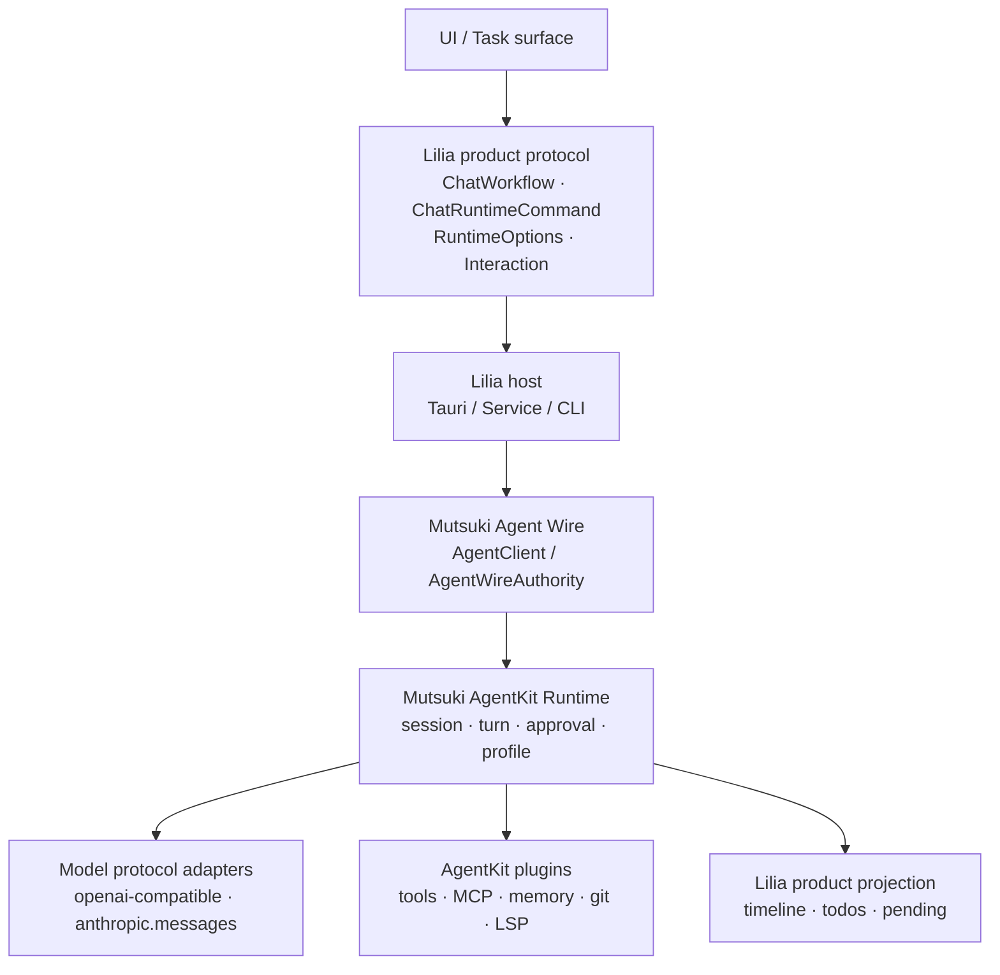

# Lilia Agent 三层协议（Mutsuki 实现）

> 状态：Lilia 产品层协议边界。唯一执行实现是 **Mutsuki AgentKit / Agent Wire**；不再对接 Claude Code / Codex 官方产品。
> 核对时间：2026-08-08。

## 总览

Lilia 拥有面向用户与桌面的 **产品协议**（工作流、运行时命令、交互、timeline）。  
Mutsuki 提供 **Agent 运行时与跨端 Wire**：session / turn / approval / model adapter / plugin。  
LiliaCore 与 `lilia-agent-integration` 是防腐层：把产品协议落到 Mutsuki，不把 Mutsuki 内部枚举泄漏到 UI。



| 层 | 所有者 | 职责 |
| --- | --- | --- |
| 产品协议 | Lilia `packages/contracts` | 用户可见 workflow、runtime command、权限交互、composer 状态 |
| 产品 Host | `apps/desktop` · `apps/service` · `apps/cli` | 任务、SQLite、UI 事件、远程观察 |
| 防腐层 | `crates/lilia-agent-integration` · `crates/lilia-core` | profile 装配、Wire 服务、事件投影 |
| Agent 实现 | Mutsuki AgentKit | session/turn、审批、budget、plugin、model gateway |
| 模型协议 | Mutsuki adapters | OpenAI-compatible / Anthropic Messages 等 **LLM API**，不是官方 Agent 产品 |

## 产品输入形状

桌面发送 turn 时，产品侧稳定形状仍为：

```ts
{
  turn: {
    cwd: string;
    prompt: string;
    attachments: ChatAttachment[];
    model: string;
    resumeSessionId?: string | null;
    planMode: boolean;
    permission: PermissionMode;
  };
  workflow?: ChatWorkflow | null;
  runtimeCommand?: ChatRuntimeCommand | null;
  runtimeOptions?: ProviderRuntimeOptions | null;
}
```

- `workflow` / `runtimeCommand` 只使用 Lilia 协议名（见 `liliaAgentProtocol.mjs` manifest）。
- `runtimeOptions.provider` **仅**允许 `"native-agentkit"` 键；不得再出现 `provider.claude` / `provider.codex`。
- chat backend 唯一合法值：`native-agentkit`（`chat-backends.json`）。

进入 Mutsuki 时，防腐层将上述内容编译为：

1. **AgentRuntimeProfile**（`lilia.product.native-coding[.workflowKind]`）
2. **AgentMessage** + turn metadata（含 Lilia workflow 语义的产品侧 prompt / control 片段）
3. **Agent Wire** 请求（`AgentWireRequestEnvelope`），经 `NativeAgentWireService` / `AgentWireAuthority`

CLI / 远程路径直接消费 **未改动的 Mutsuki Wire envelope**；HTTP 只做传输，不另起一套 Agent 协议。

## ChatWorkflow（用户可见意图）

`ChatWorkflow` 表达用户在 Lilia 里可见、可解释、可持久化的 agent 意图。  
它 **不是** Mutsuki 公共枚举，也不会写入 AgentKit 协议 id。

| workflow | 含义 | 空 prompt |
| --- | --- | --- |
| `lilia_task_workflow` | 内置工作流目录（`generalTask`、`frontend`、`refactor` 等） | 支持 |
| `lilia_review` | 对指定代码范围做审查 | 支持 |
| `lilia_fix_suggestion` | 生成或按模式应用修复建议 | 支持 |
| `lilia_batch_apply` | 批量应用 review / fix 结果 | 支持 |
| `lilia_goal` | 设置 / 刷新 / 清除线程目标 | 支持 |
| `lilia_compact` | 压缩当前会话上下文 | 支持 |
| `lilia_background_terminals_clean` | 清理会话相关后台终端 | 支持 |
| `lilia_memory_mode` | 启用或关闭记忆模式 | 支持 |
| `lilia_memory_reset` | 重置记忆 | 支持 |
| `lilia_config_diagnostics` | 读取配置诊断摘要 | 支持 |
| `automation` | 自动化触发 agent turn | 支持 |
| `slash_command` | 执行 Lilia native / 项目斜杠命令 | 支持 |

空 prompt 规则由 `packages/contracts/src/liliaAgentProtocol.mjs` 从 workflow / runtime command manifest 生成。

`lilia_task_workflow` 是 Lilia 自己的用户可见工作流，**不是**外部 Skill 管理对象。结构化 `lilia_review` / `lilia_fix_suggestion` / `lilia_batch_apply` 继续承载专用数据结构。

## ChatRuntimeCommand（运行时控制）

`ChatRuntimeCommand` 是运行时控制入口，不是 UI workflow。  
实现侧由 **Mutsuki session / host 能力** 兑现；不支持时写 Lilia diagnostic / unsupported，禁止静默吞掉。

| runtime command | 含义 | Mutsuki / Lilia 落点 |
| --- | --- | --- |
| `session_fork` | 分叉当前 agent session | `mutsuki.agent.session/fork@1` 语义；产品侧绑定新 task/session |
| `session_management` | list / info / rename / archive 等 | Lilia 产品 SQLite + AgentKit session snapshot，不读官方 CLI 历史库 |
| `runtime_settings` | 诊断 / 更新本轮 runtime 设置 | 写入 `runtimeOptions.common` 与 `provider.native-agentkit`；经 profile / turn metadata |
| `remote_environment` | 注册或选择远程执行环境 | Host / Distributed 边界；未实现时 diagnostic |
| `process_session` | 独立进程 session（spawn / stdin / kill / PTY） | Host 能力；非模型 adapter 私有通道 |
| `remote_control` | 远控启停与状态 | Lilia remote-control 契约 + PC host，**不是**官方 app-server |
| `sandbox_diagnostics` | sandbox readiness | Host 诊断；未实现时 diagnostic |

预留：realtime、file-search session。接入前必须先在本文定义 Lilia 协议名与 fallback。

## ProviderRuntimeOptions

`ProviderRuntimeOptions.common` 只保存稳定 Lilia 字段：

| 字段 | 含义 |
| --- | --- |
| `model` | 模型选择 |
| `permission` | Lilia 权限模式（`full` / `ask` / `readonly` / `free`） |
| `reasoningEffort` | 通用思考强度意图 |
| `runtimeWorkspaceRoots` | 运行时工作区根目录 |
| `modelSelection` | 智能模型选择解释（诊断与持久化） |

`provider["native-agentkit"]` 仅承载 **Native / Mutsuki 本轮选项**（model、thinking、tools allowlist、workspace roots 等）。  
模型 **协议家族** 由凭据与 profile 决定（`openai.chat-completions` / `anthropic.messages`），UI 不暴露 adapter 内部 id 作为 chat backend。

高变动能力进入 `experimentalProviderOptions[]`：

| 字段 | 规则 |
| --- | --- |
| `provider` | 必须是 `native-agentkit` |
| `capability` | 稳定 Lilia 能力名，不使用上游方法名 |
| `payload` | 防腐层 / AgentKit 内部解释 |
| `fallback` | `diagnostic` / `unsupported` / `ignore` |

UI 禁止直接构造 Mutsuki 内部 DTO 或模型厂商私有字段作为 public workflow。

## Mutsuki 实现边界

### Agent Wire

- 权威：`AgentWireAuthority`（version、idempotency、approval/cancel replay、fork、reconnect）。
- 产品实现：`AgentWireRuntime` + 持久化（`NativeAgentWireService` / `NativeAgentKitRuntime`）。
- 进程内：`InProcessAgentClient`；跨进程 / CLI：`AgentClient` + 未改 envelope 的 HTTP 或 Link。

### Session / Turn / Approval

- Session 语义由 AgentKit Session Runner 拥有；Host 注入 persistence，不复制 transcript 序号语义。
- `permission_mode` 对齐 Lilia：`ask` / `full` / `read_only`（产品 `readonly` 映射到 runtime）。
- 权限审批使用 **provider-neutral** interaction；`providerContext.native` 供 round-trip，UI 只渲染公共字段。

### Model adapters

| Adapter id | Protocol family | 用途 |
| --- | --- | --- |
| `openai-compatible` | `openai.chat-completions` | OpenAI 兼容 API / 本地代理 |
| `anthropic-messages` | `anthropic.messages` | Anthropic Messages API |

二者是 **LLM 协议适配**，不是 Claude Code / Codex 产品后端。  
禁止再引入官方 Agent Server、CLI app-server 或 Node legacy runner 作为执行路径。

### Profile

产品 profile 由 `build_product_coding_profile` 装配：

- 稳定 hint：`lilia.product.native-coding`
- workflow kind 仅作 **profile id 后缀**，不进入 AgentKit 公共 enum
- Provider instance 只绑定 `CredentialRef`；密钥留在 Credential Broker

### 事件投影

AgentKit 事件经 `project_agent_event(s)` 写入 Lilia timeline / todos / pending。  
`source` / `backend` 字段对用户与持久化统一为 `native-agentkit`（历史行可能仍带旧 brand 字符串，仅作只读兼容）。

## Interaction 契约

| kind | 语义 |
| --- | --- |
| `permission_approval` | 权限扩展审批；公共字段 + `providerContext.native` |
| `tool_consent` | 工具确认；决策枚举为 Lilia 中性名（`accept` / `decline` / `cancel` 等） |
| `ask_user` / `plan_approval` | 用户提问与计划确认 |
| `mcp_elicitation` | MCP elicitation form / url |
| `architecture` | 架构图变更确认 |

旧字段名（如历史 payload 中的 brand 专属键）只允许 **读兼容**，新写入必须使用 Lilia / native 键名。

## 落点表

| 落点 | 层级 | Lilia 语义 | 不支持时 |
| --- | --- | --- | --- |
| 普通 turn | turn | 启动一轮 agent 输入，写 timeline 与 session | error timeline |
| task / review / fix / batch / goal | workflow | 用户可见工作流 | 构造 prompt 或写错误 |
| compact / memory / diagnostics | workflow | 会话维护 | diagnostic |
| automation / slash | workflow | 自动化或命令 | 拒绝启动并保留状态 |
| session fork / management | runtime command | session 控制 | unsupported diagnostic |
| runtime settings | runtime command + options | 本轮设置 | 无有效字段则拒绝 |
| remote / process / sandbox | runtime command | Host 运行时控制 | unsupported diagnostic |
| permission / tool consent | interaction | 中性交互 | 按 `PermissionMode` 降级 |
| MCP / memory / git / LSP | AgentKit plugins + shared services | 工具与共享服务 | 单项 warning |

## 升级复核清单

1. 用户可见意图先判断是否属于 `ChatWorkflow`；session / settings / remote / process 默认 `ChatRuntimeCommand`。
2. 新增能力先定义 **Lilia 协议名** 与 fallback，再落到 Mutsuki protocol id 或 Host 能力；不得按上游方法名倒推 UI。
3. `runtimeOptions.provider` 只允许 `native-agentkit`；模型厂商差异只出现在 adapter / credential 层。
4. 升级 Mutsuki pin（见 `docs/design/mutsuki-dependency-pin.md`）后，核对 Wire、session、approval、projection 兼容性。
5. 不认识的 runtime command 或 experimental capability 必须写 diagnostic / unsupported。
6. UI 不解析 `providerContext` 内部字段，只 round-trip。
7. 禁止恢复 Claude Code SDK、Codex CLI/app-server、Node legacy agent-runner 作为默认或可选执行后端。
