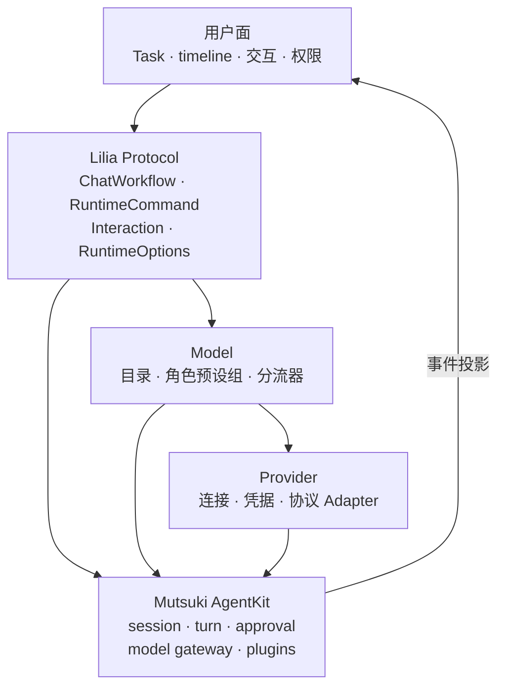
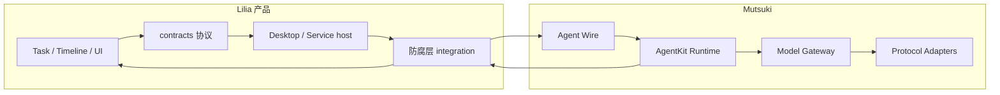

# Lilia Agent 架构：Provider · Model · Lilia Protocol

> 状态：切换到 **Mutsuki AgentKit / Agent Wire** 后的产品架构主文档。  
> 参考：oh-my-pi 的 Provider / Model 分层；Lilia 产品面以 **Task** 为主，**Session** 对用户隐形。  
> 核对时间：2026-08-09。

## 1. 一句话

| 层 | 是什么 | 不做什么 |
| --- | --- | --- |
| **Provider** | 模型提供方与**连接实现**（账号/端点/凭据/协议适配） | 不拥有对话语义、工作流、任务 UI |
| **Model** | 模型目录、**管理器**与**分流器**；模型分组并挂到角色预设组 | 不直接谈用户任务；不读密钥明文 |
| **Lilia Protocol** | 高层对话指令与产品交互契约；按设置路由到 Model，底层以 session 兑现 | 不泄漏 Mutsuki 内部枚举到 UI；不绑定某一 LLM 品牌 |

用户层只看见 **任务（Task）** 与过程（timeline / 交互）。  
AgentKit 的 **session** 是实现细节：产品通过绑定挂接，不对用户暴露「传统聊天 session」心智。



依赖方向：**Protocol → Model → Provider →（Mutsuki adapter/gateway）**。  
禁止 UI 或 Protocol 层直接拼装厂商私有 HTTP 或 Mutsuki 内部 DTO。

---

## 2. 术语表

| 术语 | 含义 | 用户是否可见 |
| --- | --- | --- |
| **Task** | 产品侧可管理工作单元；对话过程、timeline、待办、权限交互都挂在任务上 | 是 |
| **Session** | Mutsuki AgentKit 的 transcript / turn / checkpoint 载体 | **否**（实现层；产品仅持有 `AgentSessionRef` 绑定） |
| **Lilia Protocol** | 产品协议：workflow、runtime command、interaction、runtime options | 部分可见（意图与交互）；id 对用户友好展示 |
| **Provider** | LLM 提供方命名空间 + **连接实现**（如 `openai`、`anthropic`、`xai`、本地/网关实例） | 设置面可见连接与登录；不作为 chat backend 品牌 |
| **Provider instance** | 具体可调用实例：adapter + endpoint 配置 + `CredentialRef` | 高级设置 / 诊断可见 |
| **Adapter / protocol family** | LLM 线协议：`openai.chat-completions` / `openai.responses` / `anthropic.messages` 等 | 否（实现） |
| **Model** | 可选择的具体模型 id（可记为 `providerId/modelId` 或产品内稳定 id） | 是（选择器 / 自动选择结果） |
| **Model catalog** | 已注册模型清单（内置 + 发现 + 用户配置） | 选择器数据源 |
| **Model manager** | 装载目录、可用性、凭据就绪状态、覆盖与禁用 | 否（服务） |
| **Router / 分流器** | 按 protocol 信号与预设组选出本轮 model / effort | 结果可解释；规则本身可不暴露 |
| **Preset group（角色预设组）** | 按**角色/用途**组织的模型绑定，如 default / plan / fast / review | 设置面意图；部分已由 tier 自动选择近似 |
| **ModelTier** | 现有能力层级：`light` / `normal` / `deep`（自动选择实现） | 诊断与辅助设置 |
| **Chat backend** | 产品执行后端；当前唯一合法值 `native-agentkit` | 技术设置，非「Claude/Codex 产品」 |
| **CredentialRef** | 凭据不透明引用；密钥在 Host / Credential Broker | 否 |
| **AgentRuntimeProfile** | 本轮/本会话装配：adapter、provider instance、plugins、policy | 否 |
| **Agent Wire** | 跨端/进程的 session·turn·approval 信封 | 否 |

### 与旧词、oh-my-pi 的对照

| 说法 | 在本文中的位置 |
| --- | --- |
| oh-my-pi **Provider**（`anthropic` / `openai` / …） | **Provider** 层：账号/后端命名空间 + 连接 |
| oh-my-pi **Model**（`provider/model-id`）与 roles | **Model** 层：目录 + **角色预设组** + 分流 |
| oh-my-pi session | 对应 **Mutsuki session**；Lilia **不把 session 当用户主对象** |
| 历史 `provider.claude` / `provider.codex` | **废弃**；不得再写入 |
| `ProviderRuntimeOptions` | Protocol 侧「本轮运行时选项」容器；`provider["native-agentkit"]` 为 Mutsuki 本轮字段，**不是** LLM Provider 品牌表 |
| `chat-backends.json` 的 `native-agentkit` | 产品 **唯一 Agent 执行后端**，与「OpenAI/Anthropic Provider」正交 |
| 用户说的「Codex / Claude / Grok」 | 指 **LLM 提供方/模型家族** 的连接与选型，**不是**官方 Agent CLI/App 产品路径 |

---

## 3. 总览：所有权与实现落点

| 层 | 所有者 | 主要落点 |
| --- | --- | --- |
| 用户 Task 面 | Lilia 产品 | `apps/desktop` · `apps/service` · 产品 SQLite |
| Lilia Protocol | `crates/lilia-contracts` | `ChatWorkflow` · `ChatRuntimeCommand` · Interaction · RuntimeOptions |
| 防腐层 | `lilia-core` · `lilia-agent-integration` | profile 装配、Wire 服务、Task↔Session 绑定、事件投影 |
| Model 管理 / 分流 | 产品配置 + contracts 自动选择 + 运行时 profile | 目录、tier/预设、本轮 model 覆盖 |
| Provider 连接 | 产品凭据 + Mutsuki adapter/gateway | Provider instance · CredentialRef · HTTP effect |
| Agent 运行时 | **Mutsuki AgentKit** | session · turn · approval · budget · plugins · model gateway |



唯一执行实现是 **Mutsuki AgentKit / Agent Wire**。  
禁止再引入 Claude Code SDK、Codex CLI/app-server 或外部 legacy agent-runner 作为默认或可选执行后端。

---

## 4. Provider 层

### 4.1 定义

**Provider** = 模型提供方 + **如何连上它**。

对齐 oh-my-pi：

- Provider 是账号/后端**命名空间**（如 `openai`、`anthropic`、`xai`、自定义网关、`ollama`）。
- 连接方式包括：API Key、OAuth（若产品支持）、自定义 base URL、本地引擎发现等。
- 同一模型 id 可出现在多个 Provider 下；完整身份应为 **provider + model id**（或产品内等价稳定 id）。

在 Mutsuki 中对应：

| 概念 | Mutsuki / 产品落点 |
| --- | --- |
| 协议适配 | `ModelProtocolAdapter`：`openai-compatible` · `openai-responses` · `anthropic-messages` |
| 实例 | `ProviderInstanceDescriptor` / `AgentProviderInstance`（`adapter_id` + `CredentialRef` + endpoint 配置） |
| 调用 | `mutsuki.agent.model/generate@1` · `.../stream@1` + `effect.mutsuki.agent.model/http@1` |
| 密钥 | Host Credential Broker；Adapter **不读** keyring / 环境变量 / 第三方 CLI 私有存储 |

### 4.2 职责

- 注册与禁用 Provider。
- 解析连接模式（默认 API / 自定义 URL / 未配置）与凭据就绪。
- 将「品牌/端点」映射到 **协议家族 + Adapter**，而不是映射到官方 Agent 产品。
- 为 Model 层提供「该 Provider 下哪些模型当前可选」（凭据 + 未禁用 + 发现结果）。

### 4.3 不负责

- 任务、workflow、审批 UI、Persona 文案。
- 角色预设组与自动分流策略（属 Model 层）。
- Session transcript 语义（属 AgentKit）。

### 4.4 与产品 backend 的正交关系

| 维度 | 值 | 说明 |
| --- | --- | --- |
| Chat backend | 仅 `native-agentkit` | 走 Lilia → Mutsuki 的 Agent 路径 |
| LLM Provider | 多个 | openai / anthropic / 网关 / 本地等 |
| `runtimeOptions.provider` 键 | 仅允许 `"native-agentkit"` | 表示 **Native 运行时本轮选项**，不是 LLM 品牌表 |

示例（语义，非 UI 文案）：

- Provider `openai` + adapter `openai-compatible` + model `gpt-5.4`
- Provider `anthropic` + adapter `anthropic-messages` + model `claude-sonnet-4-6`
- Provider `xai` + adapter `openai-compatible`（兼容端点）+ model `grok-…`

用户口中的「Codex / Claude / Grok」应落在 **Provider + Model 选型**，不得重新打开官方 Agent 产品通道。

### 4.5 不变量

1. 生产 bundle **不**隐式注册 fake/mock Provider；缺失显式注入时 fail loud。  
2. Provider instance **只**绑定 `CredentialRef`；密钥永不进入 profile / timeline / log。  
3. UI 禁止把厂商私有字段直接当作 public workflow。  
4. 高变动能力进 `experimentalProviderOptions[]`，且 `provider` 字段必须是 `native-agentkit`，并声明 fallback。

---

## 5. Model 层

### 5.1 定义

**Model** 层管理「有哪些模型、怎么分组、本轮用谁」。

对齐 oh-my-pi 的 **model registry + role routing**，在 Lilia 中拆为：

| 组件 | 职责 |
| --- | --- |
| **Catalog（目录）** | 内置清单 + 用户配置 + 运行时发现；模型元数据（上下文、能力标签等） |
| **Manager（管理器）** | 合并覆盖、可用性（Provider 未禁用且凭据就绪）、禁用单项模型 |
| **Router（分流器）** | 输入 protocol 信号与上下文，输出本轮 `model` + `reasoningEffort`（及解释） |
| **Preset groups（角色预设组）** | 按**角色/用途**绑定默认模型与可选 fallback |

### 5.2 角色预设组（架构意图）

预设组按 **角色/用途** 组织（对齐 oh-my-pi roles），而不是按厂商品牌：

| 预设组（示例） | 用途 | 选型倾向 |
| --- | --- | --- |
| `default` | 普通 coding turn | 均衡模型 / normal 强度 |
| `plan` | 规划、架构、长程拆解 | 更强推理 / 更高 effort |
| `fast` | 压缩、诊断、轻量维护 | 小模型 / 低延迟 |
| `review` | 审查、修复建议、批量应用前分析 | 更深推理 |
| （可扩展）`subagent` / `advisor` 等 | 子代理、旁路审阅 | 成本与隔离优先 |

> **实现状态（已落地）**：内置角色预设 `default` / `plan` / `fast` / `review` 可绑定模型与思考强度；支持**自定义预设组增删**；自动分流按 protocol 信号选内置角色（见 `model-selection-defaults.json` 的 `autoPresetRules`）。  
> 旧 `ModelTier`（`light` / `normal` / `deep`）仍作兼容镜像与辅助映射。发送前可手动覆盖。  
> **发送路径**：前端 `selectModelForTurn` 在 send 前写入 `runtimeOptions.common.modelSelection`（含 `presetId`）；Rust 在关闭「辅助模型决策」时同样跑本地预设路由，保证自动化与桌面一致。

### 5.3 分流器输入 / 输出

**输入（示意）**

- Lilia Protocol：`ChatWorkflow` 类型、`planMode`、runtime command 类型  
- 上下文规模：prompt 长度、附件、上下文占用等  
- 用户显式 model / effort 覆盖  
- 当前可用 catalog（被 Provider 可用性过滤）  
- 角色预设组绑定（目标）或 tier 映射表（现状）

**输出**

- 稳定的产品侧 `model` 字符串  
- 可选 `reasoningEffort` / thinking 意图  
- `ModelSelectionExplanation`（mode、tier、source、signals、summary）

优先级建议（从高到低）：

1. 用户本轮显式指定  
2. 任务/composer 已固定的手动选择  
3. 角色预设组（或当前 tier 自动规则）  
4. 产品全局默认模型  

### 5.4 与 Provider 的边界

- Model 层**不**打开网络、**不**持有密钥。  
- 解析「模型 X 走哪个 Provider instance」时：查 catalog → 选 provider instance → 交 Mutsuki gateway。  
- fallback 链（多 Provider instance）可在 profile 的 `fallback_provider_instance_ids` 表达；产品策略决定是否启用。

### 5.5 与 Protocol 的边界

- Protocol 表达**意图**（要审查、要规划、要压缩），不直接写死厂商 model id 到 workflow 类型定义里。  
- 分流结果进入 `runtimeOptions.common.model` / `provider["native-agentkit"].model` 等本轮字段，再编入 profile / turn metadata。

---

## 6. Lilia Protocol 层

### 6.1 定义

**Lilia Protocol** 是面向用户与桌面的**高层对话指令与交互契约**。

它：

1. 描述用户想做什么（workflow）与运行时控制（runtime command）；  
2. 根据设置（权限、planMode、model 选择结果）路由到 **Model 层**；  
3. 经防腐层编译为 Mutsuki **session / turn / approval**；  
4. 把 Agent 事件投影回 **Task timeline** 与待处理交互。

它**不是** Mutsuki 公共枚举，也**不是**某一 LLM Provider 的私有 RPC。

### 6.2 产品输入形状

桌面发送 turn 时，产品侧稳定形状：

```ts
{
  turn: {
    cwd: string;
    prompt: string;
    attachments: ChatAttachment[];
    model: string;
    resumeSessionId?: string | null; // 实现层 session 引用，不对用户营销为「会话产品」
    planMode: boolean;
    permission: PermissionMode;
  };
  workflow?: ChatWorkflow | null;
  runtimeCommand?: ChatRuntimeCommand | null;
  runtimeOptions?: ProviderRuntimeOptions | null;
}
```

- `workflow` / `runtimeCommand` 只使用 Lilia 协议名（见 `liliaAgentProtocol.mjs` manifest）。  
- `runtimeOptions.provider` **仅**允许 `"native-agentkit"` 键。  
- chat backend 唯一合法值：`native-agentkit`。

进入 Mutsuki 时，防腐层编译为：

1. **AgentRuntimeProfile**（如 `lilia.product.native-coding[.workflowKind]`）  
2. **AgentMessage** + turn metadata（含产品侧 prompt / control 片段）  
3. **Agent Wire** 请求（`AgentWireRequestEnvelope`），经 `NativeAgentWireService` / `AgentWireAuthority`

远程路径直接消费**未改动的** Mutsuki Wire envelope；HTTP 只做传输，不另起一套 Agent 协议。`liliacode` 命令行入口只处理程序业务参数，不承载 Agent Wire 或交互式 Agent 能力。

### 6.3 ChatWorkflow（用户可见意图）

`ChatWorkflow` 表达可解释、可持久化的 agent 意图。  
它不是 Mutsuki 公共枚举，也不写入 AgentKit 协议 id。

| workflow | 含义 | 空 prompt |
| --- | --- | --- |
| `lilia_task_workflow` | 内置工作流目录（`generalTask`、`frontend`、`refactor` 等） | 支持 |
| `lilia_review` | 对指定代码范围做审查 | 支持 |
| `lilia_fix_suggestion` | 生成或按模式应用修复建议 | 支持 |
| `lilia_batch_apply` | 批量应用 review / fix 结果 | 支持 |
| `lilia_goal` | 设置 / 刷新 / 清除线程目标 | 支持 |
| `lilia_compact` | 压缩当前上下文 | 支持 |
| `lilia_background_terminals_clean` | 清理相关后台终端 | 支持 |
| `lilia_memory_mode` | 启用或关闭记忆模式 | 支持 |
| `lilia_memory_reset` | 重置记忆 | 支持 |
| `lilia_config_diagnostics` | 读取配置诊断摘要 | 支持 |
| `automation` | 自动化触发 agent turn | 支持 |
| `slash_command` | 执行 Lilia native / 项目斜杠命令 | 支持 |

空 prompt 规则由 `lilia-contracts` 从 workflow / runtime command manifest 派生。

`lilia_task_workflow` 是 Lilia 自己的用户可见工作流，**不是**外部 Skill 管理对象。

### 6.4 ChatRuntimeCommand（运行时控制）

`ChatRuntimeCommand` 是运行时控制入口，不是 UI workflow。  
实现侧由 **Mutsuki session / host 能力** 兑现；不支持时写 Lilia diagnostic / unsupported，禁止静默吞掉。

| runtime command | 含义 | Mutsuki / Lilia 落点 |
| --- | --- | --- |
| `session_fork` | 分叉当前 agent session | `mutsuki.agent.session/fork@1`；产品侧绑定**新 Task** 或任务内新绑定 |
| `session_management` | list / info / rename / archive 等 | 产品 SQLite 的 **Task** 元数据 + AgentKit snapshot；不读官方 CLI 历史库 |
| `runtime_settings` | 诊断 / 更新本轮 runtime 设置 | `runtimeOptions.common` 与 `provider.native-agentkit` |
| `remote_environment` | 注册或选择远程执行环境 | Host / Distributed；未实现时 diagnostic |
| `process_session` | 独立进程 session（spawn / stdin / kill / PTY） | Host 能力 |
| `remote_control` | 远控启停与状态 | Lilia remote-control 契约 + PC host |
| `sandbox_diagnostics` | sandbox readiness | Host 诊断 |

预留：realtime、file-search session。接入前必须先在本文定义 Lilia 协议名与 fallback。

### 6.5 Runtime options

`ProviderRuntimeOptions.common` 只保存稳定 Lilia 字段：

| 字段 | 含义 |
| --- | --- |
| `model` | 本轮模型（Model 层输出或用户覆盖） |
| `permission` | `full` / `ask` / `readonly` / `free` |
| `reasoningEffort` | 通用思考强度意图 |
| `runtimeWorkspaceRoots` | 运行时工作区根 |
| `modelSelection` | 智能选择解释（诊断与持久化） |

`provider["native-agentkit"]` 仅承载 **Native / Mutsuki 本轮选项**（model、thinking、tools allowlist、workspace roots 等）。

高变动能力进入 `experimentalProviderOptions[]`：

| 字段 | 规则 |
| --- | --- |
| `provider` | 必须是 `native-agentkit` |
| `capability` | 稳定 Lilia 能力名，不使用上游方法名 |
| `payload` | 防腐层 / AgentKit 内部解释 |
| `fallback` | `diagnostic` / `unsupported` / `ignore` |

### 6.6 Interaction 契约

| kind | 语义 |
| --- | --- |
| `permission_approval` | 权限扩展审批；公共字段 + `providerContext.native` round-trip |
| `tool_consent` | 工具确认；Lilia 中性决策名 |
| `ask_user` / `plan_approval` | 用户提问与计划确认 |
| `mcp_elicitation` | MCP elicitation form / url |
| `architecture` | 架构图变更确认 |

UI 不解析 `providerContext` 内部字段，只 round-trip。旧 brand 专属键只允许读兼容。

### 6.7 Protocol → Model 路由

| Protocol 信号 | Model 层倾向（现状 / 意图） |
| --- | --- |
| 普通 turn / `lilia_task_workflow` | `default` 预设或 `normal` tier |
| `planMode` / 重规划 | `plan` 预设或更高 effort |
| `lilia_review` / fix / batch | `review` 或 `deep` tier |
| compact / diagnostics / memory 开关 | `fast` 或 `light` tier |
| 用户手动选模型 | 覆盖自动路由，仍经同一 Provider 可用性检查 |

分流完成后，Protocol 携带已解析的 model 进入 Host → 防腐层 → Wire，而不是在 Adapter 内再猜意图。

---

## 7. Task（用户）与 Session（实现）

### 7.1 产品原则

- 用户打开的是 **一个任务**，不是「一个传统 chat session」。  
- 任务承载：标题、项目归属、状态、树/依赖、timeline、待处理交互、成本摘要等。  
- **Session 对用户隐形**：用户不管理 session 列表作为主工作模型；产品可用「继续 / 分叉任务」等动词，而不是「切换 session」。

### 7.2 绑定关系

产品契约：`AgentSessionBinding`

| 字段 | 含义 |
| --- | --- |
| `task_id` | 用户可见任务 |
| `agent_session` | 不透明 `AgentSessionRef`（Mutsuki session id） |
| `conversation_id` | 可选产品对话线 |
| `profile_id` | 可选装配 profile |
| `revision` | 产品乐观并发 |

规则：

- 产品 SQLite **不拥有** Agent turn/tool 状态机，只存绑定与产品投影。  
- Session 语义（transcript 序号、fork、checkpoint）由 **AgentKit Session Runner** 拥有；Host 可注入 persistence，不复制序号语义。  
- 一个 Task 可绑定一个主 session；fork 时创建新 binding（通常对应新 Task 或明确的任务内分支产品对象）。

### 7.3 用户动作 ↔ 实现

| 用户动作 | 产品对象 | 实现 |
| --- | --- | --- |
| 新建对话 / 任务 | 创建 Task | 需要时再 `session/create` 并 bind |
| 继续推进 | 打开同一 Task | 使用已有 binding 的 session resume / append |
| 分叉 | 新 Task 或可见分支 | `session_fork` + 新 binding |
| 归档 / 重命名 | 改 Task 元数据 | 可选同步 session_management；主真相在产品库 |
| 看过程 | Task timeline | Agent 事件经 `project_agent_event(s)` 投影 |

`turn.resumeSessionId` 等字段是实现挂钩，UI 文案与信息架构应坚持 **任务** 语言。

---

## 8. Mutsuki 实现边界（收敛）

### 8.1 Agent Wire

- 权威：`AgentWireAuthority`（version、idempotency、approval/cancel replay、fork、reconnect）。  
- 产品：`AgentWireRuntime` + 持久化（`NativeAgentWireService` / `NativeAgentKitRuntime`）。  
- 进程内：`InProcessAgentClient`；跨进程远程客户端：`AgentClient` + 未改 envelope 的传输。

### 8.2 Session / Turn / Approval

- Session 由 AgentKit 拥有。  
- `permission_mode`：`ask` / `full` / `read_only`（产品 `readonly` → runtime）。  
- 审批交互 **provider-neutral**；`providerContext.native` 仅 round-trip。

### 8.3 Model adapters

| Adapter id | Protocol family | 用途 |
| --- | --- | --- |
| `openai-compatible` | `openai.chat-completions` | OpenAI 兼容 / 本地代理 |
| `openai-responses` | `openai.responses` | OpenAI Responses API |
| `anthropic-messages` | `anthropic.messages` | Anthropic Messages API |

三者是 **LLM 协议适配**，不是 Claude Code / Codex 产品后端。  
基本对话与 Simple ReAct 由 AgentKit 提供；Persona / 审批 UI / 产品工作流不进 Mutsuki。

### 8.4 Profile

`build_product_coding_profile` 等产品装配：

- 稳定 hint：`lilia.product.native-coding`  
- workflow kind 仅作 **profile id 后缀**，不进入 AgentKit 公共 enum  
- Provider instance 只带 `CredentialRef`

### 8.5 事件投影

AgentKit 事件 → Lilia timeline / todos / pending。  
`source` / `backend` 对用户与新写入统一为 `native-agentkit`（历史行旧 brand 只读兼容）。

---

## 9. 落点表

| 落点 | 所属层 | Lilia 语义 | 不支持时 |
| --- | --- | --- | --- |
| 配置 API Key / 端点 | Provider | 连接与凭据就绪 | 模型不可选 / 连接诊断 |
| 模型目录与禁用 | Model | 可选集合 | 选择器为空或 warning |
| 角色预设 / tier 自动选择 | Model | 默认本轮 model | 回退全局默认并解释 |
| 用户覆盖 model | Model + Protocol | 本轮强制选型 | 非法 id 拒绝发送 |
| 普通 turn | Protocol → Mutsuki | 启动一轮输入，写 Task timeline | error timeline |
| task / review / fix / batch / goal | Protocol workflow | 用户可见工作流 | 构造 prompt 或写错误 |
| compact / memory / diagnostics | Protocol workflow | 维护类意图 | diagnostic |
| automation / slash | Protocol workflow | 自动化或命令 | 拒绝启动并保留状态 |
| session fork / management | Protocol runtime command | **实现** session 控制；**产品** 更新 Task/binding | unsupported diagnostic |
| runtime settings | Protocol + options | 本轮设置 | 无有效字段则拒绝 |
| remote / process / sandbox | Protocol runtime command | Host 控制 | unsupported diagnostic |
| permission / tool consent | Protocol interaction | 中性交互 | 按 `PermissionMode` 降级 |
| MCP / memory / git / LSP | Mutsuki plugins + shared services | 工具与共享服务 | 单项 warning |
| Task 持久化 / 树 / 归档 | 产品 Host | 用户工作模型 | 产品错误，不写入 Agent 伪 session |

---

## 10. 不变量（总表）

1. **用户主对象是 Task**，不是 session。  
2. **三层单向依赖**：Protocol → Model → Provider → Adapter/Gateway。  
3. **唯一 Agent 执行后端**：`native-agentkit`（Mutsuki）。  
4. **LLM Provider ≠ 官方 Agent 产品**；禁止恢复 Claude Code / Codex 官方执行路径。  
5. **密钥不出 Host 边界**；profile / timeline / log 只有 `CredentialRef`。  
6. **新增能力先定 Lilia 协议名与 fallback**，再映射 Mutsuki protocol id；不得按上游方法名倒推 UI。  
7. **不认识的 runtime command / experimental capability** 必须 diagnostic / unsupported。  
8. **UI 不构造 Mutsuki 内部 DTO**；不解析 `providerContext` 内部字段。  
9. **Model 分流可解释**：自动选择写入 `modelSelection`；静默换模禁止。  
10. **production 无隐式 mock Provider**。

---

## 11. 升级与变更复核清单

1. 用户可见意图先判断是否属于 `ChatWorkflow`；session / settings / remote / process 默认 `ChatRuntimeCommand`。  
2. 变更是否只动 Provider（连接）、只动 Model（目录/预设/分流）、还是 Protocol（契约）？禁止跨层塞私货。  
3. 新增模型或提供方：先 Provider 连接与 adapter，再进 catalog，再挂预设组/tier。  
4. 新增 workflow：定义协议名、空 prompt 规则、默认预设/tier、失败 fallback。  
5. `runtimeOptions.provider` 只允许 `native-agentkit`。  
6. 升级 Mutsuki pin（见 `mutsuki-dependency-pin.md`）后核对 Wire、session、approval、projection、model gateway。  
7. Task↔Session 绑定变更不得把 Agent transcript 复制进产品「第二事实源」。  
8. 文档与 UI 文案检查：是否把实现 session 推销成用户主概念。

---

## 12. 相关文档

| 文档 | 内容 |
| --- | --- |
| [产品定位](../guide/product.md) | Task 工作台定位 |
| [功能状态](../guide/features.md) | 交付勾选 |
| [Mutsuki 依赖 pin](./mutsuki-dependency-pin.md) | git/path 切换 |
| [RuntimeDomain 参考](./mutsuki-runtime-domains.md) | 多运行域装配 |
| [Android 远控](./android-remote-control.md) | 远程 Task 面仍走本协议 |
| Mutsuki AgentKit `docs/architecture.md` · `model-protocols.md` · `model-gateway.md` | 上游实现细节 |

---

## 13. 与 oh-my-pi 的取舍（摘要）

| 借鉴 | Lilia 差异 |
| --- | --- |
| Provider 命名空间 + 连接/凭据 | 产品执行永远经 Mutsuki；不把 omp 当 runtime |
| Model registry + 角色路由 | 角色预设组为架构目标；当前以 tier 自动选择为落地近似 |
| 多 Provider 同模型 id | 支持同一语义；产品主对象仍是 Task |
| Session 为 agent 工作载体 | **Session 隐形**；用户管理 Task，binding 挂钩 session |
| 丰富 slash / roles | Lilia 用 Protocol workflow + 项目命令 + 任务树表达工程组织 |

本文是 **Lilia 产品架构** 的契约级说明，不是 Mutsuki 或 oh-my-pi 的实现副本。实现以本仓库 contracts 与 Mutsuki pin 为准；预设组等标注为「架构意图」的能力在落地前不得在 UI 假装已可用。
