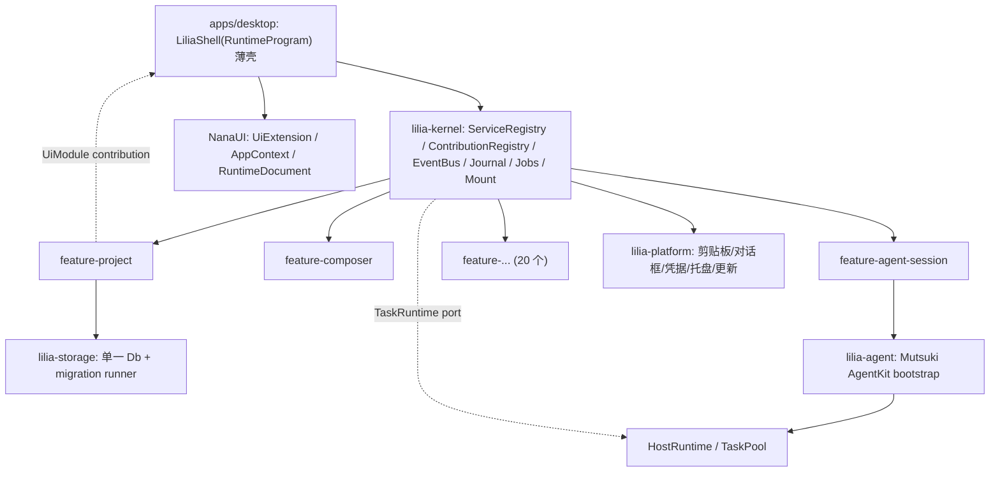

# 微内核 + Feature 插件架构

本文是 LiliaCode 的目标结构约束。它取代"`DesktopApplication` 是唯一入口"的分层，改为**内核提供机制、Feature 提供能力、宿主只做装配**。

## 为什么是微内核而不是 ECS

NanaUI 内部用 `bevy_ecs` 做存储引擎，但对外只暴露 `RuntimeProgram` / `AppContext` / `ComponentView` / `UiExtension`；Mutsuki 完全不含 ECS，它是 `Task` → `TaskPool` → `Runner::run_batch` → `RunnerResult` 的任务图。把 ECS 引入应用层既不匹配 NanaUI 的对外契约，也和 Mutsuki 无关。

三者真正的公约数是：**注册表 + 类型化事件 + 追加式事实日志 + 可逆挂载**。这也是内核唯一要提供的东西。

## 消灭的缺陷

| 缺陷 | 表现 | 内核对应机制 |
|------|------|--------------|
| 上帝对象 A | `apps/desktop/src/desktop.rs` 35,446 行，`DesktopProgram` 约 290 字段 / 551 方法 | UiModule 契约 + 每 Feature 私有 state/Msg |
| 上帝对象 B | `impl DesktopApplication` 散落 57 个文件，`DesktopApplicationInner` 约 30 个 `pub(crate)` 字段 | `ServiceRegistry` 的类型化槽位 |
| 异步手工作坊 | 35 处裸 `thread::spawn` + `*_operation_sequence` / `active_*_operation` / `*_busy` / `*_error` 四件套 | `Jobs` 门面 + `JobSlot` 单飞（四件套已清零，`*_busy` 改为从 `active_*_job` 派生的方法） |
| Agent 双权威 | `agent.rs` 3,824 行自建 turn FSM | 见 [agent-authority-gap.md](agent-authority-gap.md) |
| 持久化分裂 | 同一 `product.db` 被多模块各开连接 | `lilia_storage::Db` 单句柄 + 迁移 runner |
| UI 缓存二次事实 | 字段镜像应用状态，粗粒度 `DesktopEventKind` 整片 refresh | 类型化 `EventBus` + `snapshot` 直读权威 |

## 结构



## 内核（`crates/lilia-kernel`，零产品知识）

内核只有五个机制，任何一个都不认识 LiliaCode 的词汇。

### ServiceRegistry

按 `ServiceKey` 的 `TypeId` 索引槽位，值是 `Arc<dyn Trait>`。`ServiceRef` 同时携带 `TypeId` 与静态名，所以错误消息里出现的是 `lilia.project.store` 而不是一串类型 hash。

```rust
pub trait ServiceKey: 'static {
    type Value: Clone + Send + Sync + 'static;
    const NAME: &'static str;
}
```

重复 provide 同一槽位是错误，不是覆盖。`unmount` 撤销该 Feature 提供的全部槽位。

### ContributionRegistry

宿主专有的词汇（UI 模块、Agent 工具描述符、迁移、debug target）不进内核类型。Feature 通过 `cx.contribute::<C>(item)` 追加到一个由宿主定义的 `Contribution` 集合，宿主用 `kernel.take_contributions::<C>()` 取走。内核只知道"有序集合"和"属于哪个 Feature"。

### EventBus

类型化 topic，一条共享单调序号。两种消费方式：

- `on::<E>(handler)` — 同步处理，在 publish 线程上执行，用于 Feature 内部的精确失效。
- `observe(observer)` — 通用观察者，拿到 `EventEnvelope`，用于跨线程投递给 UI。

取代 30 变体的 `DesktopEventKind` 广播。事件说明"什么事实变了"，消费者据此**精确**重读，不再整片 refresh。

### Journal

追加式、单调序号的事实日志，记录 mutation / job 迁移 / 事件 / 生命周期四类 `RecordKind`。它是 DeepSeek Harness session log 的对应物，天然支撑 replay、`cargo xtask agent-debug` 与既有 `equivalence.rs` 校验。`JournalSink` 允许宿主把记录导出到文件或 debug harness。

`Kernel::with_journal` 接受宿主已有的 `Journal`。宿主先于内核起，bootstrap 阶段建的服务已经在写事实，用两份日志会让同一次操作分裂成两条互不相关的序列。

### Jobs

长任务的唯一入口。

```rust
pub struct JobRequest {
    pub protocol: String,
    pub payload: Value,
    pub idempotency_key: Option<String>,
    pub slot: Option<JobSlot>,
}
```

- `idempotency_key`：同键重复提交返回同一 `JobHandle`。
- `slot`：单飞车道。新提交自动 supersede 同槽旧任务，旧任务转 `JobState::Superseded` 并被丢弃——这一条直接替代 `*_operation_sequence` 四件套。
- 每次状态迁移 publish `JobEvent` 并写 Journal。

内核不实现执行器，只声明端口：

```rust
pub trait TaskRuntime: Send + Sync + 'static {
    fn submit(&self, spec: &TaskSpec) -> Result<TaskTicket, JobError>;
    fn cancel(&self, ticket: &TaskTicket) -> Result<(), JobError>;
    fn poll(&self, ticket: &TaskTicket) -> Result<TaskProgress, JobError>;
}
```

桌面构建注入 Mutsuki `HostRuntime`（`lilia-agent` 的 `LiliaJobRuntime`），于是幂等键、取消、租约、子任务、事件序列全部白拿。测试注入假实现。**UI 层不得再出现 `thread::spawn`。**

运行中的 handler 通过 `JobContext` 与内核通信：

```rust
pub type JobHandler = Arc<dyn Fn(Value, &JobContext) -> Result<Value, String> + Send + Sync>;
```

- `context.report(value)` 写进度，内核映射为 `JobState::Running { progress }`。
- `context.is_cancelled()` 是协作式取消点；内核 `cancel` 与 slot supersede 都会置位。

因此 UI 只需要 `active_*_job: Option<JobId>` 一个字段，phase / percent / busy / error 全部从 `JobEvent` 推导。

### 唯一扩展点

```rust
pub trait Feature: Send + Sync + 'static {
    fn id(&self) -> FeatureId;
    fn requires(&self) -> Vec<ServiceRef> { Vec::new() }
    fn provides(&self) -> Vec<ServiceRef> { Vec::new() }
    fn protocols(&self) -> Vec<JobProtocol> { Vec::new() }
    fn mount(&self, cx: &mut FeatureContext<'_>) -> Result<(), KernelError>;
}
```

`protocols` 与 `requires` / `provides` 一样是**声明**：Mutsuki 的 `RuntimeBootstrapper` 在构建时一次性绑定 handler 集合、不接受动态注册，所以宿主先收集全部 Feature 的协议装配 `LiliaJobRuntime`，再 `mount_all`。

`requires` / `provides` 是**声明**，在任何 Feature 代码运行之前用 Kahn 排序确定挂载顺序。缺依赖、槽位重复提供、依赖成环都在这一步失败，进程不会半初始化。

`mount` 期间通过 `FeatureContext` 做的每一次 `provide` / `on` / `contribute` 都被记账，`Kernel::unmount` 逐项撤销。这支撑 feature flag、debug fixture 与热重载。

## UI 侧对齐 NanaUI

- 每个 Feature 贡献一个 `UiModule`：私有 `state` 切片、私有 `Msg` 子枚举、`reduce` / `snapshot` / `mount` / `sync`。`Message`（约 450 变体）与 `ShellIntent`（约 179 变体）随之解体为每个 Feature 自己的小枚举，中间 2000 行 `apply_shell_intent` 手工映射一并删除。
- 根 `LiliaShell` 实现 NanaUI `RuntimeProgram`，缩到数百行：持 `Kernel` 与 `Vec<Box<dyn UiModule>>`，把 `Message::Feature(FeatureId, payload)` 路由给对应模块，负责 `RuntimeDocument` 的 mount/flush 与多窗口。
- 自定义控件走 NanaUI `UiExtension` / `ExtensionRegistrar`（`register_component` / `register_activation` / `register_action`），不再在 `runtime_shell.rs` 手工装配整棵树。
- **Feature 不缓存应用事实**：`snapshot` 直接读权威 service，靠细粒度事件精确失效。

## 长任务统一 TaskPool

每个长操作是"协议 + Runner"，由所属 Feature 声明。

已落地：`lilia.project/clone@1`（进度 + 取消）、`lilia.update/check@1` 与 `lilia.update/install@1`（共用 `lilia.update` 单飞车道）、`lilia.composer/optimize-prompt@1`（每个编辑面各一条车道）、`lilia.code/search@1` 与 `lilia.code/refresh@1`（搜索与刷新分属两条车道，刷新不抢占操作者正在等的搜索）、`lilia.extensions/mutate@1`（skills / plugins / hooks / MCP 七类操作共用 `lilia.extensions` 车道）、`lilia.remote/operate@1`、`lilia.provider/credential@1`、`lilia.provider/assistant-probe@1`、`lilia.usage/quota@1`、`lilia.github/bind@1` 与 `lilia.github/repositories@1`、`lilia.document/diagnostics@1` 与 `lilia.document/definition@1`、`lilia.suggestion/generate@1`、`lilia.worktree/operate@1`、`lilia.import/plan@1` 与 `lilia.import/execute@1`、`lilia.agent/title@1`（每个任务一条车道）。

`apps/desktop` 里已经没有任何 `*_operation_sequence` / `active_*_operation` 字段。

尚未清零的两项：`DesktopProgram` 仍有 11 个 `*_busy` 与 16 个 `active_*_job` 并存，这些 `*_busy` 要等 UI 侧按域拆分时一起删；`AtomicBool` 仍在 `change_feed.rs`、`project_files.rs`、`registry_watch.rs`、`title_update.rs`、`single_instance.rs`，但它们都是常驻监视线程的停机旗标，不是长操作的取消旗标——常驻监视不是 Job，不该套单飞车道。

`lilia.document/*` 而不是 `lilia.lsp/*`：这两条查询由 `lilia-feature-document` 拥有，协议命名跟着拥有它的 Feature 走，方便从协议名反查该改哪个 crate。

`desktop.rs` 里只剩两处线程，都不是长操作：

- `lilia-desktop-events` 是常驻的事件桥，一个订阅一个循环，本来就该是线程。
- markdown 图片加载有自己的 LRU 准入策略（同时限制在飞 worker 数与常驻缓存条目数，按最近使用排序决定先读哪张），需要的是并发预算而不是单飞车道；它的结果是原始图片字节，进 payload 就等于把几 MB 二进制写进 Journal。它属于视图层资源加载，不是产品操作。

### 应用层要发起 Job 时，经壳层队列而不是自己持有内核

自动标题是唯一一个由应用层而非壳层发起的长操作：触发点在回合 worker 判定 `completed` 的那一行，压缩回合同样以 `Completed` 收尾却不该改名，所以壳层无法只靠 `TurnStateChanged` 复现这个条件。

它原来自带一个双线程池加有界队列，外加一个按任务的 `generation` 计数判定哪份答案还新鲜——正是内核三件事各自的手写版本。现在 `DesktopTitleUpdateCoordinator` 只保留"这份提案是否已被后续回合作废"的判定（模型返回后还要再判一次，单飞车道替代不了），执行与去重交给 `lilia.agent/title@1`。

让应用层直接持有 `Jobs` 会成环：`lilia.agent/title@1` 的 handler 持有 `DesktopApplication`，应用层再持有 `Jobs` 就闭合成 application → Jobs → runtime → handler → application，整条链谁都不会释放。因此应用层只拿一个出站 `DesktopTitleUpdateScheduler`，实现把请求投进壳层消息队列，由壳层提交 Job。提交 Job 的位置仍然只有壳层一处。

调度器用 `OnceLock` 装一次：没装等于任务不改名，不阻塞刚结束的回合；装两次直接报错，避免两个宿主同时改同一个任务的标题。

### 结果与命令不进 payload 时的 Exchange

多数长操作的请求与结果都可以序列化，直接走 payload 与 `JobState::Completed { output }`——`lilia.remote/operate@1` 与 `lilia.usage/quota@1` 就是这样。两种情况不行：

- 命令携带密材（MCP 凭据、Provider API Key、辅助模型连通性测试用的未保存 API Key）。写进 payload 就等于写进 Journal。
- 命令是活的资源句柄而不是数据（导入步骤持有 `DesktopApplicationConfig` 与宿主句柄，代表已打开的文件锁与 OS 服务），根本无法序列化。
- 结果是壳层形状的视图集合（工作区刷新一次读回 snapshot / git / workspace / task 四份），feature crate 不认识这些类型。

这两类用 `apps/desktop/src/desktop.rs` 的 `JobExchange<C, O>`：壳层把命令寄存到票据下，payload 只带 `ticket` 与操作名，宿主 port 在 worker 线程上取出命令、执行、把结果寄回同一票据，壳层在 `JobState::Completed` 时取走。Journal 记得到车道与操作名，记不到密材。Provider 的 API Key 更进一步——`StagedProviderSecret` 只暂存一份密钥，port 方法签名里根本没有密钥参数。

### Handler panic 必须留在自己的车道里

一个线程一个操作的时代，handler panic 只毁掉那一个操作。换成共享 TaskPool 后不再是这样：`JobRunner::run_batch` 一次处理一批 entry，panic 会顺着栈穿出去，这一批里的其他 job 全部拿不到终态，内核会永远轮询它们，提交过它们的界面永远停在 busy。

所以 `crates/lilia-agent/src/job_runtime.rs` 用 `catch_unwind` 把 handler 包起来，panic 转成普通的 job 失败。爆炸半径回到"一个操作"，这是线程模型本来就给的保证，共享 TaskPool 不该把它拿走。

同理，壳层侧 `JobExchange` 与 `StagedProviderSecret` 取锁用 `PoisonError::into_inner` 而不是 `expect`：这些临界区只搬一个值进出 map，锁中毒只说明别处 panic 过，为此杀掉窗口是把一次失败的操作放大成一次丢失的会话。

### 迁移一个长操作的固定步骤

`lilia.project/clone@1`（带进度与取消）与 `lilia.update/check@1` / `lilia.update/install@1`（共用一条 `lilia.update` 单飞车道）是已落地的样板，其余域照抄：

1. 把执行逻辑搬进 feature crate，**删掉**它自己的线程、`Condvar`、`sequence` 与 `*Operation` 句柄类型，改成在调用线程上同步执行的函数，签名收 `&JobContext`。
2. 进度改为 `context.report(serde_json::to_value(Progress)?)`；取消点改为轮询 `context.is_cancelled()`，进程类操作在取消点终止进程树。
3. 定义可序列化的请求/结果类型作为协议 payload。**凭据不进 payload**：定义一个 credentials trait 由宿主实现，handler 在 worker 线程上解析，令牌不落 payload 也不落 Journal。
4. Feature 的 `protocols()` 返回 `JobProtocol::new(PROTOCOL, handler)`，并导出一个 `*_slot()` 单飞车道。
5. 壳层删除 `*_operation_sequence` / `active_*_operation` / `*_busy` 句柄字段，只留 `active_*_job: Option<JobId>`；`start_*` 改为 `jobs().submit(JobRequest::new(..).in_slot(..))`，`cancel_*` 改为 `jobs().cancel(job_id)`，进度与终态在 `Message::KernelJob(JobEvent)` 里按 `job_id` 匹配后投影。
6. 原模块的测试跟着搬到 feature crate：它们不再需要构造 `DesktopApplication`，只需要一个 `JobContext::new()`。

## 持久化统一

`lilia-storage` 暴露单一 `Db`：一个文件一个 `Arc<Mutex<Connection>>`，一处配置 `foreign_keys` / WAL / busy timeout，一个有序的 `lilia_migrations` 账本。

`product.db` 由 `ServiceAuthority` 的 `SqliteProductStore` 首先建 schema，其余域通过 `SqliteProductStore::db()` 加入同一句柄，进程内不存在第二个 writer。

**再入约束**：`Db::lock()` 返回的是非可重入互斥。持有 guard 时不得调用任何会再次取锁的方法；需要后续读取时先 `drop(guard)`。

## Crate 重排

- 保留：`lilia-contracts`（产品词汇 + JSON 契约）。
- 新建：`lilia-kernel`、`lilia-platform`（OS 端口）。
- 改造：`lilia-storage`（单 Db + 迁移）、`lilia-agent`（Mutsuki bootstrap 与 AgentKit 插件注册）。
- 新建 `crates/features/lilia-feature-*`，一个领域一个 crate，用编译期边界强制解耦。
- 收缩：`crates/lilia-desktop-application` 解散，其 57 个 `impl` 文件按域迁入对应 feature crate；`apps/desktop` 只剩 launcher、`LiliaShell`、feature 清单与 platform 实现。

### 迁移进度

已落地的 feature crate（22 个，均已挂载进 `apps/desktop/src/kernel_host.rs`）：

`project`、`task`、`composer`、`timeline`、`agent-session`、`terminal`、`document`、`worktree`、`memory`、`roadmap`、`architecture`、`automation`、`usage`、`update`、`coding`、`extensions`、`hooks`、`provider`、`remote`、`suggestions`、`github`、`import`。

`github` 与 `import` 只声明协议、payload 与车道，执行留在宿主 port：一个要驱动 device flow 的轮询循环并在取消点撤销刚拿到的授权，另一个跑在 `DesktopApplicationConfig` 与活的宿主句柄之上——这些是打开的文件锁与 OS 服务，不是数据，搬进 crate 只会把 `lilia-desktop-application` 的类型一起拖进来。

`lilia-desktop-application` 里剩下的 `import` 实现是执行体本身（复制 SQLite 文件、迁移凭据），由 `lilia-feature-import` 的 port 调用。

装配本身有测试：`apps/desktop/src/kernel_host.rs` 的 `tests` 用一组 in-memory 服务与拒绝一切的 port 真正启动一次 `KernelHost`，断言声明的 Feature 全部挂载、id 不重复、协议 id 不重复、且壳层会提交的每一个协议都有 Feature 声明。协议重名会让运行时拒绝启动，协议漏声明只在用户点到时才失败——两件事都是启动期事实，所以在启动期断言。

### 过渡期的 shim 约定

已迁出的域在 `crates/lilia-desktop-application/src/<域>.rs` 留一层薄壳，只做两件事：`pub use` feature crate 的类型，以及把 `impl DesktopApplication` 的方法转发给 feature service。壳层不得再持有该域的状态或逻辑。`lilia-desktop-application` 解散时这层壳整体删除。

薄壳一旦退化成纯 `pub use`，当场删掉而不是等解散：`lib.rs` 改为直接从 feature crate 再导出，调用点不用改。`memory`、`roadmap`、`turn_queue` 与 `conversation_suggestions` 的 `types` / `generation` / `local_git` 已按此删除。`architecture.rs` 例外——它还挂着 `#[cfg(test)] mod tests`，删掉只会把测试声明挪到更难找的地方。

feature crate 不认识 `DesktopEventBus`。需要广播的域在自己 crate 里定义事件 trait（`TerminalEvents`、`AutomationEvents`、`ProjectTaskEvents`），由 `lilia-desktop-application` 提供 `Broadcast*` 适配器桥到 `DesktopEventKind`。这层适配器与壳层同时删除。

### 剩余缺口

长操作已经收口，域**类型**已经下沉。回合权威与壳层入口已经落地。剩下三件：

- `ActiveTurnPhase` 七态已删。`DesktopAgentRuntime` 只做队列协调；`turn_claim_epoch` + `claim_token` 仍在，直到 AgentKit 有 `SessionVersion` ack 替代。壳层经 `QueuedTurnExecutor` 把 `lilia.agent/turn@1` / `approval@1` / `interaction@1` 交给内核。对照与取舍见 `docs/design/agent-authority-gap.md`。
- 入口已改名 `LiliaShell`，`Message` 已按域拆成 17 个子枚举。但**这只是把变体搬了位置**：变体总数仍约 430，`update_message` 与全部 `apply_*` 仍在 `apps/desktop/src/desktop.rs` 的同一个 28,000 行 `impl DesktopProgram` 里。`UiModule` 契约已落地在 `apps/desktop/src/ui_module.rs`，但尚无域迁入。
- `crates/lilia-desktop-application` 已从 workspace 移除，实现暂收在 `apps/desktop/src/application`。其中 `agent.rs`、`import.rs`、`remote.rs`、`workspace.rs`、`extensions.rs`、`todo.rs` 仍是实现本体而非转发壳。

### `DesktopProgram` 的字段分三类，只有一类能在拆分前处理

把「删掉镜像字段」当成一件事会做错。逐个看过之后是三类：

- **派生态**：11 个 `*_busy` 与 `active_*_job` 表达同一件事。已删除，改为从 job 句柄派生的方法。它们本来必须在每条终态、取消与重置路径上同步清零，漏一处就留下一个没有 job 在跑却禁用着的界面——`worktree_busy` 就有这个 bug：`apply_worktree_job` 在终态清 job 句柄，却只在 `Failed` 时清 `worktree_busy`，成功路径依赖领域事件补清，事件不到就永久卡住。`active_worktree_job` 现在带上 TaskId，因为它的车道本来就是按任务分的，切换任务应该释放界面而不是取消还在跑的操作。
- **渲染缓存**：`projects` / `tasks` / `task_move_candidates` 只有 `apply_workspace_snapshot` 一个写入点，是带显式失效的缓存，不是失控镜像。改成 snapshot 里直读 service 等于把 37 处访问变成 37 次 SQLite 查询，落在渲染路径上——与「不可见的面不投影」同一条约束冲突。它们该做的是收归到模块私有，不是删掉。
- **按窗口换入换出的编辑态**：`tasks` / `roadmap` / `memories` / `architecture*` 还被 `apply_project_workspace_editor_state` 整片存取——`DesktopProgram` 当成了每个工作区窗口的暂存板。这类字段在「每个模块拥有自己的 state」存在之前无法拆，所以它们必须排在 `UiModule` 契约之后，不是之前。

### `UiModule` 契约的形状与它卡住的地方

契约取的是「模块把自己那几个字段折进窗口投影」，不是「模块返回自己的投影」：`project(&self, cx, into: &mut PrimaryShellSnapshot)`。这样 `runtime_shell.rs` 六千行 reconcile 不用动，14 个域可以一个一个迁，没迁的域继续由壳层写同一个快照。注册顺序即折叠顺序，两个模块抢同一字段会表现为后者覆盖前者，所以字段归属冲突是可见的而不是静默的。

上下文只给 `&Kernel`。这不是为了纯粹——一个必须被喂进 projects 列表的模块一定会把它存下来，存下来的那份就是会漂移的那份。所以共享事实先下沉成槽位，模块自己 resolve。

真正决定模块怎么写的是第三类字段的机制，不是字段数量：`with_workspace_window_project_state` 把 `DesktopProgram` 的 `tasks` / `roadmap` / `memories` / `architecture*` 当成**寄存器**——把某个工作区窗口的编辑态换入，跑一次操作，再换出。所以这些字段不是「一份状态」而是「每窗口一份状态 + 一个共用寄存器」。

选定的方向是取消寄存器：模块按窗口各持一份实例，没有换入换出。落地形状是三件——

- 会话槽位从「一个 session」改成 `lilia.shell.workspace_sessions` 注册表，按 `WindowId` 存取。窗口在 mount 之后才开，而槽位只能 provide 一次，所以槽位里放注册表而不是实例；`WindowId` 直接沿用 NanaUI 的窗口身份，不另造一个枚举。
- contribution 交的是**工厂**而不是实例：每个工作区窗口要自己的一份，两个窗口编同一个项目不能共享编辑态。`UiModuleRegistry` 持工厂，`host()` 给一个窗口配一套。
- `UiModuleContext` 带上 `WindowId`，模块 resolve「我这个窗口的」session。这没有违背只给 `&Kernel` 的约束——窗口身份不是事实，是问哪一份事实。

寄存器不会一次消失：它同时管四个域加选择态，四个域都成模块之后剩下的只有 `selected_project` / `inbox_selected` / `selected_task` / `project_surface` 的换入换出，20 多字段的 `ProjectWorkspaceEditorState` 与它的 capture / apply 两个函数才能删。

### 内核机制的消费者缺口

内核五个机制里 `Jobs` 与 `Journal` 已接满消费者，另外三个的状态要如实记着，否则后来者会以为它们在工作：

- `ServiceRegistry`：13 个 `ServiceKey` 全部 provide。`lilia.shell.workspace_sessions` 是第一个有产品 `resolve` 的槽位：`DesktopWorkspaceSession` 本来就是 `Arc<Mutex<..>>` 背书的可克隆句柄，持有 projects / tasks / 选择 / 面板布局的唯一写入权，所以它是共享事实下沉成 service 的自然形状，而不需要为此新造一层。`DesktopProgram` 现在从槽位读它而不是私藏句柄；工作区窗口开关时同步 install / remove，关窗即移除，避免平台回收的窗口号继承上一个窗口的会话。`ProjectTaskService` 的双实例已消除——壳层在 bootstrap 时建实例，`TaskFeature::mount` 把同一实例 provide 进槽位，事件经 `ProjectTaskEventFanout` 同时进 `DesktopEventKind` 与 `EventBus`。方向是壳层给内核而不是内核给壳层，因为壳层先于内核起，持久化在 bootstrap 阶段就要能写。其余槽位的产品消费者仍是壳层直接持句柄，`resolve` 只在装配测试里用；22 个 feature 之间没有任何跨 crate 依赖，所以 `requires()` 全为空是当前依赖图的实情，不是遗漏——`mount_all` 的 Kahn 排序在真实图上就是一层。
- `ContributionRegistry`：`apps/desktop/src/ui_module.rs` 定义了宿主专有的 `UiModules` 集合，`UiModuleRegistry::from_kernel` 在 `DesktopProgram::initialize` 里 `take_contributions` 取走工厂，主窗口与每个工作区窗口各配一套 `UiModuleHost`，投影汇合点已在 `primary_shell_snapshot` 上线。当前注册数为 0，所以这条管道有结构没有流量；`reduce` 路由要等第一个域迁出时一并接上，那时才知道路由表该按哪些 `FeatureId` 分。
- `EventBus`：唯一产品订阅是 `kernel_host.rs` 的 `JobEvent`。feature crate 零订阅，UI 仍走 39 变体的 `DesktopEventKind` + `refresh_*`。
- `Journal`：4096 条环形缓冲。四类 `RecordKind` 都有产品写入点——lifecycle 与 job 由内核写，`Event` 由 `EventBus::publish` 写（`JobEvent` 以 `JOURNALED = false` 退出，避免与 `Jobs` 自己的 job 记录重复），`Mutation` 由 `ProjectTaskService` 在每次写入后写，记的是操作名与幂等键是否命中——事件只说"行动了"，说不出这次是新写还是重放。`apps/desktop/src/journal_export.rs` 是 `JournalSink` 的产品实现：`LILIA_JOURNAL_PATH` 指向文件时，记录经专用线程逐条落盘（UI 线程与 job worker 上不做文件系统调用），`cargo xtask agent-debug` 把它设为 `journal.jsonl` 并校验序号单调与 feature 挂载记录齐全。

### UI 渲染路径上的性能约束

`RuntimeProgram::update` 每收到一条 `Message` 就无条件重建 `PrimaryShellSnapshot` 并同步整棵树。这条路径上有两类必须守住的规则：

- **不可见的面不投影**。设置页、自动化页、项目页的快照字段按 `settings_open` / `automations_open` / `project_page` 收窄；对应的 `sync_*` 也在同一条件上提前返回。设置页的 8 个集合与十几个 `format!` 曾经每次击键都重算一遍。
- **reconcile 只在输入变化时跑**。`sync` 是快照的纯函数，所以 `ShellHandles` 记住上次真正同步过的侧栏行、任务行与时间线行，输入相同就整段跳过。时间线的 markdown 另按源文本 hash 缓存：`NativeMarkdown::parse` 加 `assemble_markdown` 是这条路径上最重的 CPU，源文本没变就不该重跑，否则击键成本随会话历史长度线性增长。

这两条在 `UiModule` 落地后应变成契约的一部分（每个模块自己判断是否需要 `sync`），在那之前靠 `apps/desktop/src/runtime_shell.rs` 的 `SyncedInputs` 与提前返回守住。

`cargo xtask performance` 的一项已知未过：`panelResizeFrameP95Ms` 约 115ms，门槛 100ms。三点背景——
一，这一步此前从未真正执行过，`xtask/src/performance.rs` 把 `extent` 当 JSON 数字发，而调试协议的字段一律是字符串，请求在边界就被拒了，所以这个指标没有历史基线；
二，把上面的分区跳过扩展到工作区页、面板条与检视器后，该指标没有变化（111ms → 119ms，在噪声内），说明成本不在产品侧投影与 reconcile，而在 NanaUI 对整窗区域改尺寸的重排与重绘；
三，调试 socket 只在 `debug_assertions` 下存在，所以门禁只能测未优化构建，这个数字不代表发布态。
结论：不通过阈值的方式绕过，也不为它改产品代码；要动就动 NanaUI 的区域重排。

## 硬约束

- 不引入 `bevy_ecs` 到应用层；通用 Native 控件与窗口能力仍归 NanaUI。
- 不重建第二套 Agent 宿主或任务编排脚本。
- 跨边界数据先改 `crates/lilia-contracts/contracts` 再同步消费者。
- Feature 之间只通过 service 槽位与事件通信，禁止直接依赖对方 crate 的内部类型。
- `cargo xtask verify` 的测试步骤必须是 `--workspace`。它曾经硬编码四个包，于是内核、`lilia-agent` 与二十个 feature crate 的测试一次都没跑过，门禁"全绿"只说明它没在看新代码。新增 crate 不需要改门禁，这一条就是为了保证不需要。
