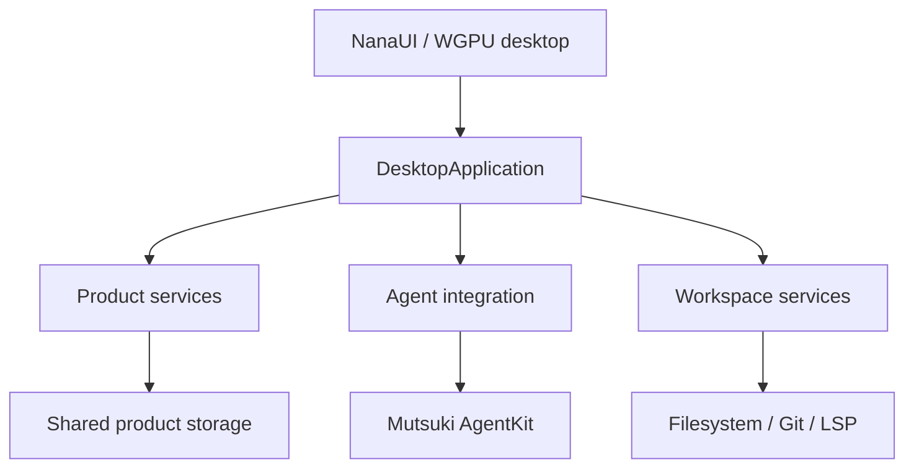

# LiliaCode Native IDE 架构

本文约束正式 LiliaCode 桌面的职责边界，并为文件树、编辑器、LSP、调试和版本控制能力保留稳定扩展点。

## 分层

- NanaUI/WGPU 负责窗口、布局、输入与渲染，不持有产品事实。
- `DesktopApplication` 是所有桌面工作流的类型化入口，协调查询、mutation、事件和长任务。
- Product、Agent 与 Workspace service 分别持有领域规则；UI 不直接访问 SQLite、provider 或 Git 子进程。
- `DesktopEvent` 只通知事实已变化，消费者收到事件后重新读取权威 snapshot。

## 数据权威

每个桌面进程只能 bootstrap 一个 `ServiceAuthority`。正式桌面使用 `LILIA_HOME`（默认 `~/.lilia`）和凭据身份 `liliacode`，只消费共享 Product/Agent 权威。

legacy `db/lilia.db` 不得被打开、写入或双写。旧数据只能通过显式 plan/execute 导入，在隔离与校验完成后原子提交；失败或取消保持目标 home 不变，不自动删除源数据。

所有 mutation 使用稳定 ID 与 expected revision。磁盘写入、外部进程和 provider handshake 在全局锁外准备，提交前重检 revision，持久化成功后才发布事件。

## 任务、会话与 Composer

- Task 与 session binding 属于 Product authority；窗口只保存选择、面板和草稿等表现状态。
- 新会话提升为任务、fork、重挂载和 worktree 切换通过应用服务事务完成。
- Composer 的发送、排队、中断、pending interaction 和附件解析使用类型化命令；不可由控件直接启动 runner。
- 显式取消删除该 task 的可执行队列并发布终态；暂停中的 turn 不会被后续队列项越过。
- Goal、Todo、计划、权限和 AskUser 都是事实事件或 pending interaction，不以临时 UI 状态代替持久化结果。

## Workspace 与 IDE 能力

路径解析、ignore 规则、symlink 边界、文本解码、revision 与 Git 操作属于 Workspace service。文件选择与编辑写入必须拒绝 `..` 逃逸和超出项目根的 symlink，并通过 expected revision 防止静默覆盖。

长操作返回 operation handle，提供有序进度、取消和 terminal outcome。文件树、搜索、Git clone、索引和 LSP 不阻塞 UI 线程；窗口关闭时必须取消或安全移交仍在运行的操作。

编辑器、LSP、诊断、Git diff 和调试器通过明确端口接入，不把协议细节塞进 NanaUI widget。可复用编辑、Dock 或窗口能力属于 NanaUI；项目、任务和 Agent 语义属于 LiliaCode。

侧栏行继续用 `SidebarRow`（行内停止 / 菜单 / 草稿需要指针处理）；NanaUI `ReorderList` 只能放被动 `ReorderItem`，接上可嵌行工具的重排容器前不发明拖拽。

## 自动化

workflow draft、发布版本、run 和 node state 由 `DesktopAutomationService` 持有。创建 run 与全部 node state 必须在单个事务中完成，并原子拒绝同 workflow version 的重复并发执行。

Tool/Agent 副作用使用 `run_id + node_id` 幂等键。Canvas 只提交类型化 graph mutation，不直接写任务、Todo、Memory 或文件。等待人工响应的 node 持久化为 waiting，恢复时从权威 node state 继续。

## Agent Debug

`cargo xtask agent-debug` 通过 Native 开发态 TCP 协议执行结构化 observe/act，并保存真实 GPU 截图与业务 snapshot。固定 corpus 位于 `tests/desktop/`，无凭据且不访问网络；随机 ID、时间和绝对路径必须归一化。

Debug 协议不进入 Release。离屏测试可验证确定性状态，但不能替代真实窗口、GPU、安装、更新或设备验收。

## 性能与发布门禁

`cargo xtask performance` 对 Composer、resize、千条时间线、冷启动及空闲 CPU/RSS 使用固定 corpus，分别判断绝对阈值和历史基线。

各桌面平台的入口都是薄启动器：先显示应用图标，再加载同目录宿主库。Windows 发布由 `cargo xtask release windows --tag <tag>` 生成 `liliacode.exe`、`liliacode_host.dll`、NSIS 安装包、签名更新归档和 `latest.json`。随后 `cargo xtask installer-smoke --tag <tag>` 验证安装、启动、CLI、单实例、覆盖升级、卸载与 PATH 清理，并确认用户数据未被删除。
